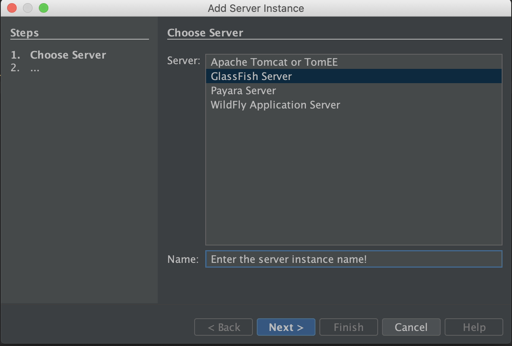
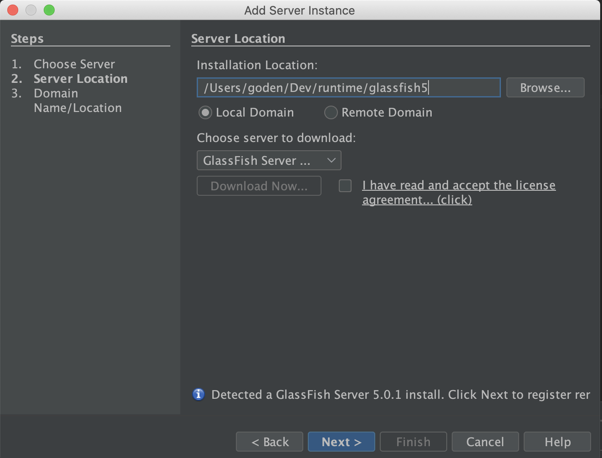
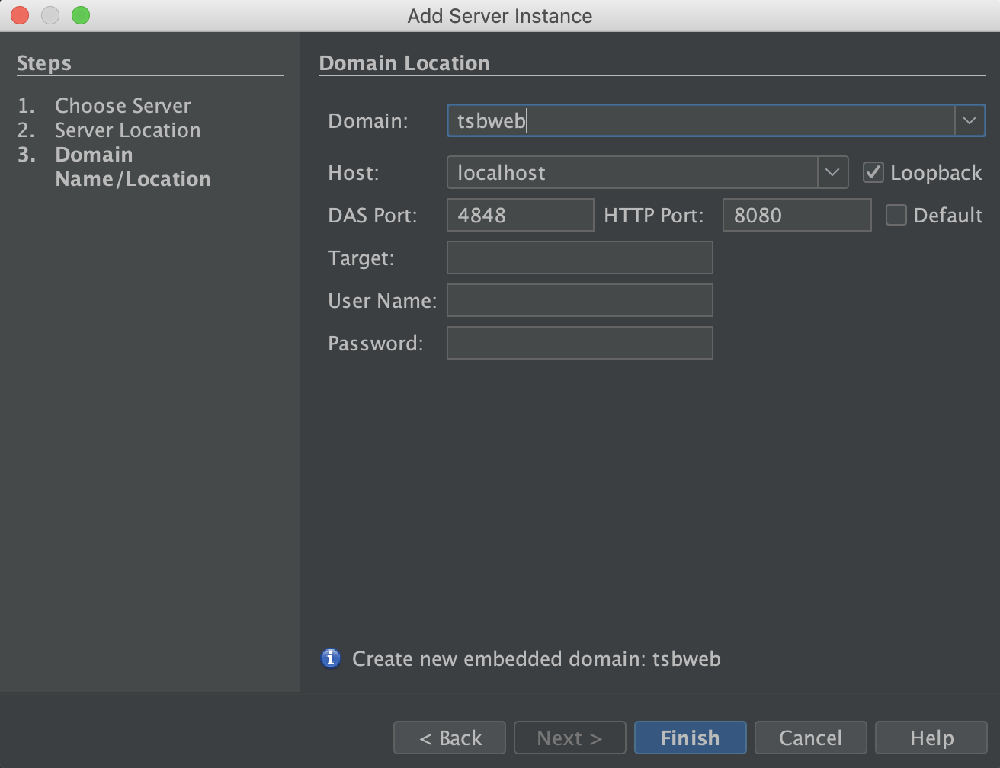
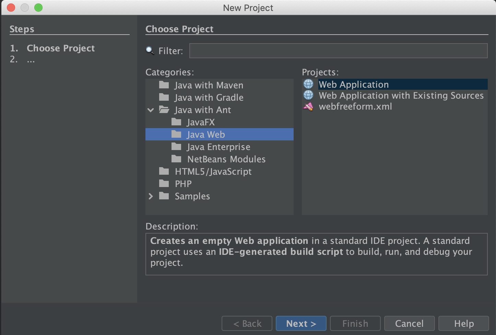
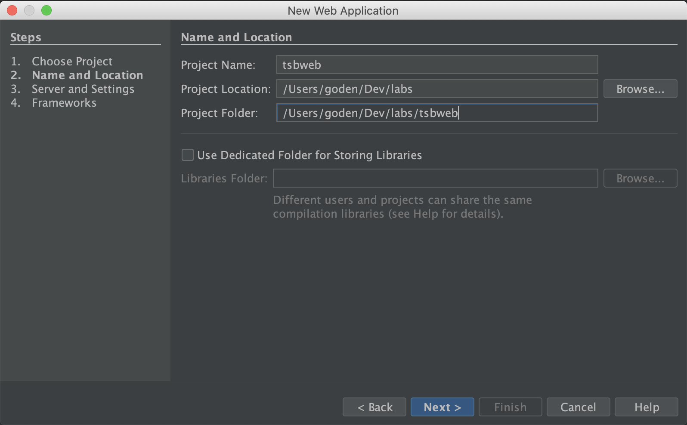
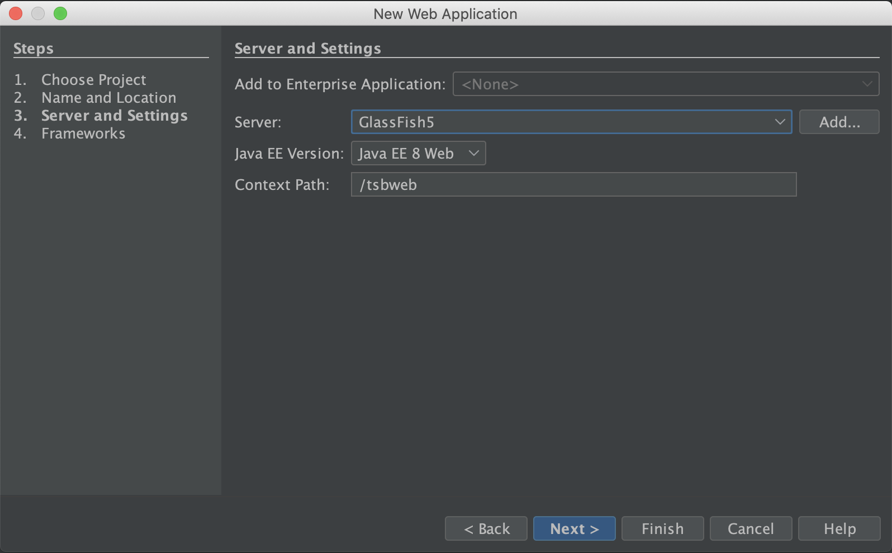

#tsbweb

## Brief
A java web project running in glassfish by development netbeans.

## Enviornments

Below tools are used going through the repository building:

- **Netbeans**. An intregrated IDE to deveop J2EE in common. It is strongly recommended to download the latest LTS version, the current version is 12.0 on writing this paragraph. The Java SDK should be installed prior to the Netbeans. ([Download](https://netbeans.apache.org/download/nb120/nb120.html))
- **GlassFish**. A application server that implements J2EE. The current version is 5.0 with J2EE 8 implements.  ([Download](https://download.oracle.com/glassfish/5.0/release/index.html))

## Get Started

### Add Application Server

Add the GlassFish aforementioned  as an new application server which running a java web project. Follow the below steps to complete the new application server addition:

1. Uncompress the glassfish to the target path. `GLASSFISH_HOME` is the directory that place the glassfish, e.g, `/Users/Demo/Dev/Labs/tsbweb`.
2. Open the netbean and switch the **Services** perspective as below illustration:
   
3. Right-click the **Servers** item and click **Add Server...** option to launch the **Add Server Instance** wizard.
4. Select the **GlassFish Server** option of the Server field and enter the server instance name of the **Name** field. Click **Next** to the next step.
   
5. Assign the absolute path of the GLASSFISH_HOME as the **Installation Location**. Click **Next** to the next step.
   
6. Enter the **tsbweb** as the **Domain** field. Click **Finish** to add the server.
   

### Create New Project

Suppose the Netbeans and GlassFish installations are complete before getting started.

1. Create a java web project by clicking **File** > **New Project** to launch the winzard in the **Netbeans**.
2. Select the **Web Application** from the **Java with Ant** > **Java Web**. Click **Next** to next step.
   
3. Enter the **tsbweb** as **Project Name** field and ensure the path. Click **Next** to the next step.
   
4. Assign the instance at the **Add Application Server** section. Click **Finish** to complete the creation project.
   

### Running Web Project

After the creation the web project, run the application server to check the web project is functioning. Right-click the **tsbweb** project and select the **Run** item to build the project. The browser will open the demo page once the deployment has been done.
