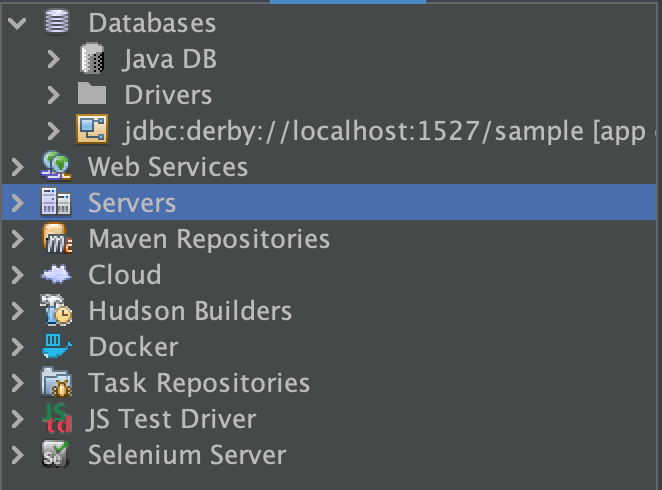
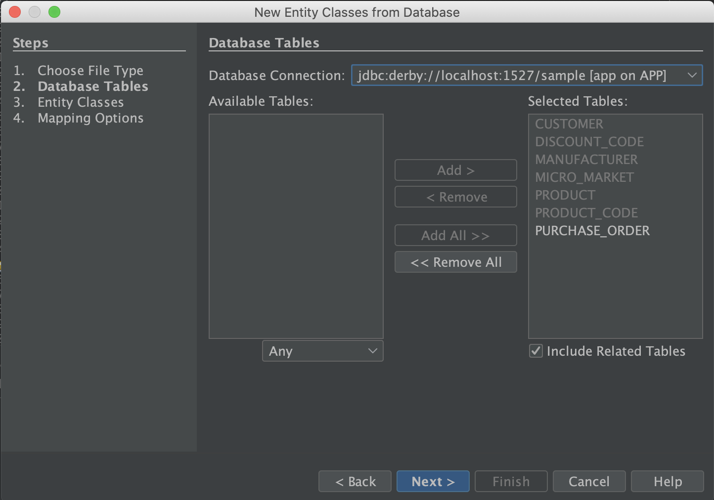
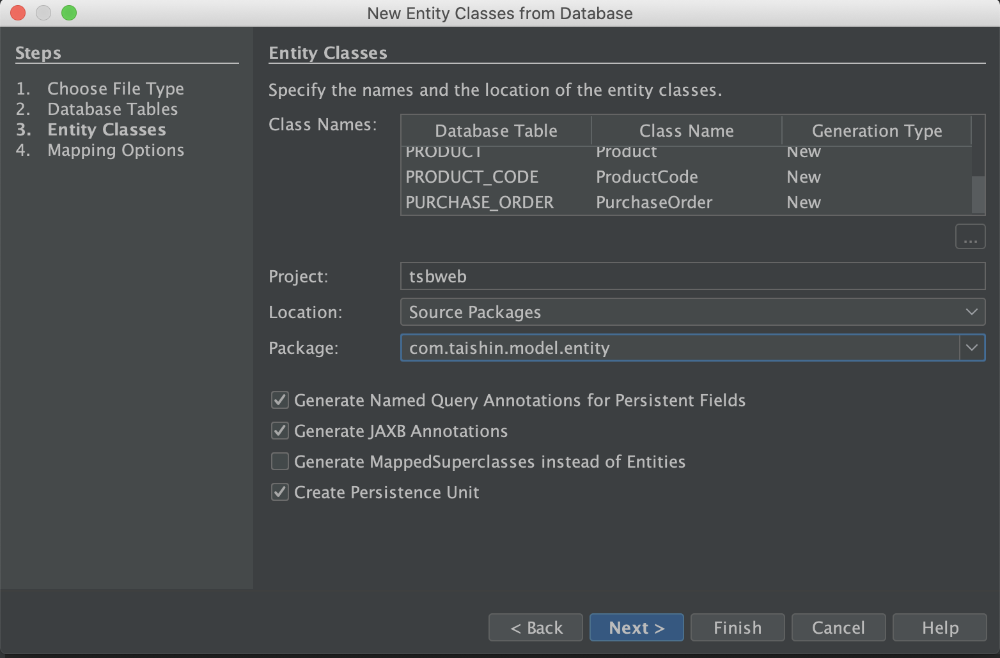
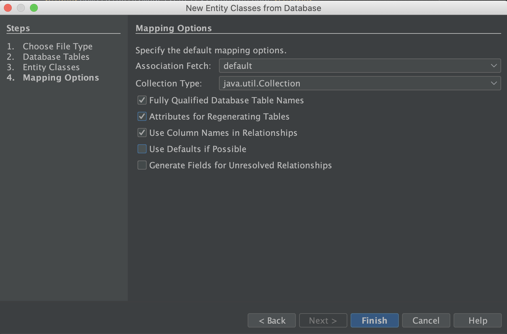
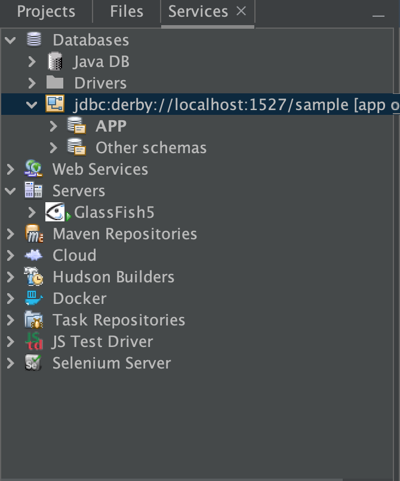
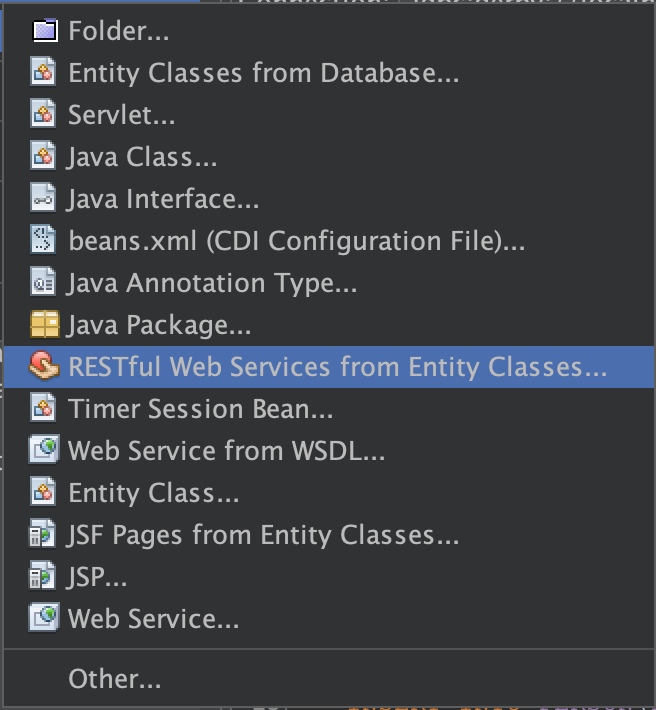
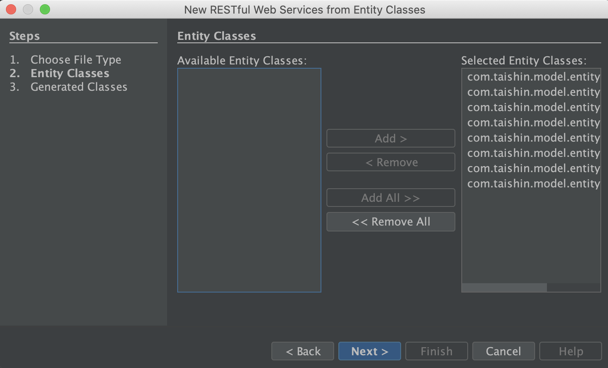
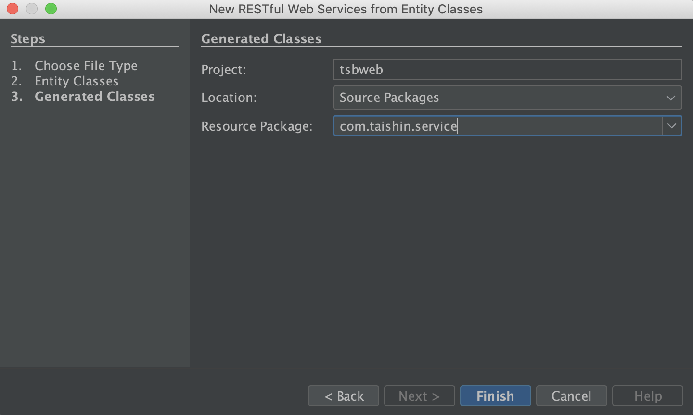

#tsbweb

## Brief
A java web project running in glassfish by development netbeans.

## Enviornments

Below tools should be installed:

- **Netbeans**. An intregrated IDE to deveop J2EE in common. It is strongly recommended to download the latest LTS version, the current version is 12.0. The Java SDK should be installed prior to the installation. ([Download](https://netbeans.apache.org/download/nb120/nb120.html))
- **GlassFish**. A application server that implements J2EE. The current version is 5.0 with J2EE 8.  ([Download](https://download.oracle.com/glassfish/5.0/release/index.html))

## Get Started

### Add Application Server

Add the GlassFish aforementioned  as an new application server which running a java web project. Follow the below steps to complete the new application server addition:

1. Uncompress the glassfish to the target path. `GLASSFISH_HOME` is the directory that place the glassfish, e.g, `/Users/Demo/Dev/Labs/tsbweb`.
2. Open the netbean and switch the **Services** perspective as below illustration: <br/>
   
3. Right-click the **Servers** item and click **Add Server...** option to launch the **Add Server Instance** wizard.
4. Select the **GlassFish Server** option of the Server field and enter the server instance name of the **Name** field. Click **Next** to the next step. <br/>
   
5. Assign the absolute path of the GLASSFISH_HOME as the **Installation Location**. Click **Next** to the next step.
   
6. Enter the **tsbweb** as the **Domain** field. Click **Finish** to add the server.
   

### Create New Project

Suppose the Netbeans and GlassFish installations are complete before getting started.

1. Create a java web project by clicking **File** > **New Project** to launch the winzard in the **Netbeans**.
2. Select the **Web Application** from the **Java with Ant** > **Java Web**. Click **Next** to next step.
   
3. Enter the **tsbweb** as **Project Name** field and ensure the path. Click **Next** to the next step.
   
4. Assign the instance at the **Add Application Server** section. Click **Finish** to complete the creation project.
   

### Running Web Project

Run the application server to make sure the web project is functioning on the application server. Right-click the **tsbweb** project and select the **Run** item to build the project. The browser will open the demo page once the deployment has been done.

### Generate New Entity Classes from Database

In order to fast generate the entity classes from the database, follow the below steps to complete the generation:

1. Right-click the project and select the **Entity Classes from Database...** item. Click **Next** to launch the wizard.
2. Assign the right database connection and move all the tables of the **Available Tables** to the **Selected Tables**. Click the **Next** to the next  step.
   
3. Assign the package and **com.taishin.model.entity** is the destination. Click **Next** to the next step.
   
4. Specify the default mapping options. Select the **Fully Qualified Database Table Names** and **Attributes for Regenerating Tables** options. Click **Finish** to complete the generation.
   

### New Table Generation in Existing Database

In case of generation new table in existing database as below snippet, how to generate the table and insert the required data?

```sql
CREATE TABLE PERSON
(
	ID INTEGER NOT NULL GENERATED ALWAYS AS IDENTITY (START WITH 1, INCREMENT BY 1),
	FIRSTNAME VARCHAR(20),
	LASTNAME VARCHAR(20),
	STREET VARCHAR(50),
	CITY VARCHAR(20),
  CONSTRAINT primary_key PRIMARY KEY (ID)
);


INSERT INTO PERSON(FIRSTNAME,LASTNAME,STREET,CITY) VALUES('Laura','Steel','429 Seventh Av.','Dallas');
INSERT INTO PERSON(FIRSTNAME,LASTNAME,STREET,CITY) VALUES('Susanne','King','366 - 20th Ave.','Olten');
INSERT INTO PERSON(FIRSTNAME,LASTNAME,STREET,CITY) VALUES('Anne','Miller','20 Upland Pl.','Lyon');
INSERT INTO PERSON(FIRSTNAME,LASTNAME,STREET,CITY) VALUES('Michael','Clancy','542 Upland Pl.','San Francisco');
INSERT INTO PERSON(FIRSTNAME,LASTNAME,STREET,CITY) VALUES('Sylvia','Ringer','365 College Av.','Dallas');
INSERT INTO PERSON(FIRSTNAME,LASTNAME,STREET,CITY) VALUES('Laura','Miller','294 Seventh Av.','Paris');
INSERT INTO PERSON(FIRSTNAME,LASTNAME,STREET,CITY) VALUES('Laura','White','506 Upland Pl.','Palo Alto');
INSERT INTO PERSON(FIRSTNAME,LASTNAME,STREET,CITY) VALUES('James','Peterson','231 Upland Pl.','San Francisco');
INSERT INTO PERSON(FIRSTNAME,LASTNAME,STREET,CITY) VALUES('Andrew','Miller','288 - 20th Ave.','Seattle');
INSERT INTO PERSON(FIRSTNAME,LASTNAME,STREET,CITY) VALUES('James','Schneider','277 Seventh Av.','Berne');
INSERT INTO PERSON(FIRSTNAME,LASTNAME,STREET,CITY) VALUES('Anne','Fuller','135 Upland Pl.','Dallas');
INSERT INTO PERSON(FIRSTNAME,LASTNAME,STREET,CITY) VALUES('Julia','White','412 Upland Pl.','Chicago');
INSERT INTO PERSON(FIRSTNAME,LASTNAME,STREET,CITY) VALUES('George','Ott','381 Upland Pl.','Palo Alto');
INSERT INTO PERSON(FIRSTNAME,LASTNAME,STREET,CITY) VALUES('Laura','Ringer','38 College Av.','New York');
INSERT INTO PERSON(FIRSTNAME,LASTNAME,STREET,CITY) VALUES('Bill','Karsen','53 College Av.','Oslo');
INSERT INTO PERSON(FIRSTNAME,LASTNAME,STREET,CITY) VALUES('Bill','Clancy','319 Upland Pl.','Seattle');
INSERT INTO PERSON(FIRSTNAME,LASTNAME,STREET,CITY) VALUES('John','Fuller','195 Seventh Av.','New York');
INSERT INTO PERSON(FIRSTNAME,LASTNAME,STREET,CITY) VALUES('Laura','Ott','443 Seventh Av.','Lyon');
INSERT INTO PERSON(FIRSTNAME,LASTNAME,STREET,CITY) VALUES('Sylvia','Fuller','158 - 20th Ave.','Paris');
INSERT INTO PERSON(FIRSTNAME,LASTNAME,STREET,CITY) VALUES('Susanne','Heiniger','86 - 20th Ave.','Dallas');
INSERT INTO PERSON(FIRSTNAME,LASTNAME,STREET,CITY) VALUES('Janet','Schneider','309 - 20th Ave.','Oslo');
```

Follow the below steps to complete the table generation in exiting database:

1. Switch the **Services** perspective. Find the database instance from the **Database** item.
   
2. Right-click the instance and select the **Execute Command...** from the contextmenu. Post the SQL snippet and run the SQL by clicking the  icon. Ensure the table generation is OK after the command execution is done.
3. Repeat the aforementioned steps in the [New Table Generation in Existing Database](#new_table_generation_in_db) section to generate the `Person` table.

### Generate Session Beans for Entity Classes


1. Launch the wizard to select the **Session Beans for Entity Classes** item by right-clicking the project. 
2. Select the **Session Beans for Entity Classes** of the **Persistence** item and click **Next** to the next step.

### Generate RESTful Web Services from Entity Classes

After the generation of the entity class from database is complete, the mapping RESTful service should be created.

1. Launch the wizard to select the **RESTful Web Services from Entity Classes...** item.
   
2. Select the all entity classes and click the **Next**.
   
3. Select the target directory to place the generated service class files. Enter the com.taishin.service as the **Resource Package** field. Click **Finish** to complete the generation.

